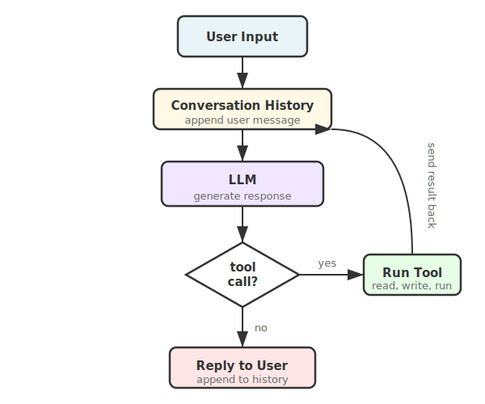

I read an article by Amp on how to build an agent and decided to build one myself, but in Python using Groq instead of Go and Anthropic.

## What is an AI agent

An agent is just a normal application making calls to an LLM API, but doing it in a loop in a non-deterministic way. It has three things: a loop, some tools (functions it can call), and a conversation history it sends to the model every turn. That is all there is to it.

## What I built

I built Grunty. A lightweight autonomous code editing agent you run in your terminal. Point it at any repo and it can explore the codebase, read files, make changes, run commands, and fix errors on its own.

The code is nothing complex. If you go to the repo and read main.py and tools.py you will understand what is happening right away. No magic.

## What went wrong

I started with the Gemini API because the Google SDK lets you pass Python functions directly as tools without writing explicit declarations. But I kept hitting rate limits which got frustrating fast. Switched to Groq which has a generous free tier and never looked back.

The other thing that caught me off guard — the agent wiped an entire file when I asked it to add one line to it. Turned out I needed two separate tools, one for creating files and one for making precise edits. A small design decision that made a big difference.

## What I learned

Start with the bare minimum. Add frameworks and design patterns only when complexity demands it.

I first heard about agentic AI 8 months ago and someone told me to learn LangChain. I jumped in and could not understand anything that was happening and gave up. Coming back to it now and building from scratch, everything makes sense. Unnecessary complexity right at the start is the fastest way to kill momentum.

### Code

Find the code at [grunty](https://github.com/saurabhje/grunty-coding-agent/)